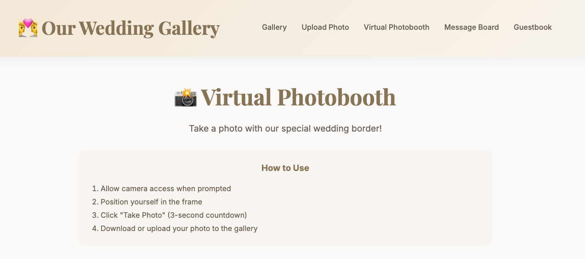
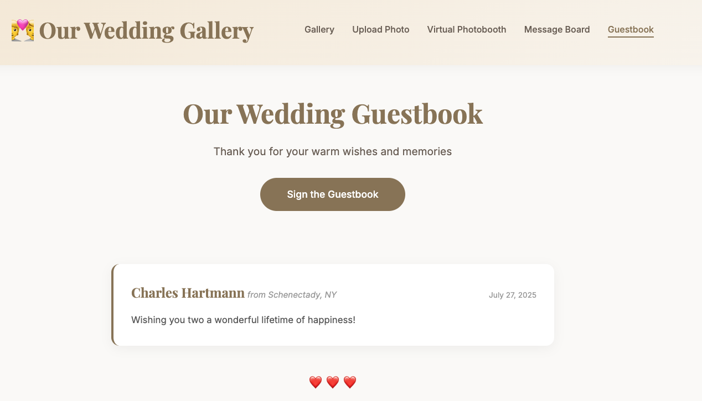

# 💑 VowVault - Wedding Photo Gallery

A beautiful, self-hosted wedding photo gallery application that allows wedding guests to upload and share photos without requiring any login. Built with Flask and designed with love for your special day.


## 📋 Table of Contents

### 🚀 Getting Started
- [✨ Features](docs/features.md) - Complete feature overview for guests and admins
- [🚀 Installation Guide](docs/installation.md) - Quick start and production deployment
- [📱 Usage Guide](docs/usage.md) - Step-by-step instructions for guests and admins
- [📱 Progressive Web App](docs/pwa.md) - PWA installation and troubleshooting

### 🔧 Technical Documentation
- [🏗️ Modular Architecture](docs/MODULAR_STRUCTURE.md) - Application structure and organization
- [🔄 Refactoring Summary](docs/REFACTORING_SUMMARY.md) - Recent code refactoring details
- [🐳 Docker Setup](docs/DOCKER_SETUP.md) - Docker configuration and deployment
- [🔧 Docker Compatibility](docs/DOCKER_COMPATIBILITY.md) - Docker-specific fixes and improvements
- [📧 Email Setup](docs/EMAIL_SETUP.md) - Email configuration for photo uploads
- [🔄 Immich Integration](docs/IMMICH_SETUP.md) - Immich server synchronization
- [🔐 SSO Setup](docs/sso_setup.md) - Single Sign-On authentication configuration

### 🛠️ Development & Debugging
- [🔧 PWA Debug Tools](docs/pwa.md#debugging) - PWA troubleshooting and testing
- [📱 Template Fixes](docs/TEMPLATE_FIXES.md) - Template routing and URL fixes
- [🐳 Docker Template Fix](docs/DOCKER_TEMPLATE_FIX.md) - Docker-specific template issues
- [📚 Documentation Organization](docs/ORGANIZATION_SUMMARY.md) - Documentation structure overview

### 📸 Visual Documentation
- [📸 Screenshots](#-screenshots) - Visual tour of the application

## 🔄 Recent Updates

### Major Refactoring (Latest)
The application has been completely refactored from a monolithic structure to a modern, modular Flask application:

- ✅ **Modular Architecture**: Converted from single `app.py` (3,000+ lines) to organized Blueprint structure
- ✅ **Enhanced Features**: Added comprehensive push notification system with web interface + browser notifications
- ✅ **Improved Performance**: Better code organization and maintainability
- ✅ **Docker Optimization**: Enhanced Docker compatibility and deployment
- ✅ **PWA Support**: Full Progressive Web App functionality with Service Worker
- ✅ **Debug Tools**: Comprehensive debugging panel for PWA and notification testing

**Key Improvements**:
- **50 files changed** with **5,359+ lines** of improved code
- **Flask Blueprints** for organized routing (`app/views/`, `app/models/`, `app/utils/`)
- **Application Factory Pattern** for better configuration management
- **Push Notification System** with dual web interface + browser notifications
- **Service Worker** for offline functionality and PWA support
- **Comprehensive Documentation** with detailed setup guides

## ✨ Quick Overview

### For Guests
- 📸 **Easy Photo/Video Upload** - No login required, drag-and-drop interface
- 🔍 **Search & Tagging** - Find photos quickly with search and custom tags
- 📧 **Email Photo Upload** - Send photos directly via email
- 🤳 **Virtual Photobooth** - Take photos with custom wedding borders
- ❤️ **Like & Comment** - Interact with photos and videos
- 🔔 **Smart Notifications** - Get notified when someone interacts with your content
- 💌 **Message Board** - Share messages with optional photos
- 📖 **Virtual Guestbook** - Sign digital guestbook with photos
- 📱 **PWA Support** - Install as native app on mobile devices
- 🏆 **Photo of the Day** - Vote for daily featured photos with automatic candidate selection based on popularity

### For Admins
- 🔐 **Admin Dashboard** - Comprehensive management tools
- 🔐 **SSO Authentication** - Secure admin access with OAuth providers (Google, Azure, Okta)
- 📊 **Statistics** - View usage analytics and content metrics
- 📧 **Email Configuration** - Set up automatic photo processing
- 🔄 **Immich Sync** - Sync to your own Immich server
- 📱 **PWA Debug Tools** - Monitor and troubleshoot PWA issues
- 💾 **Batch Download** - Download all content as ZIP file
- 🏆 **Photo of the Day Management** - Select and manage daily featured photos with automatic candidate system

## 📸 Screenshots

### Gallery & Upload

*Main gallery showing uploaded photos and videos with like/comment functionality*


*Easy photo and video upload with drag-and-drop support*

### Mobile Experience

*Responsive design optimized for mobile devices*


*Progressive Web App installation prompt on mobile*

### Admin Dashboard

*Comprehensive admin panel with statistics and management tools*


*PWA debugging and troubleshooting tools*

### Interactive Features

*Virtual photobooth with custom wedding borders*


*Interactive message board with photo sharing*


*Digital guestbook with photo attachments*


*Daily photo voting system with engagement tracking*

## 🚀 Quick Start

### Using Docker (Recommended)
```bash
git clone https://github.com/chartmann1590/VowVault.git
cd VowVault
docker-compose up -d
```

### Manual Installation
```bash
git clone https://github.com/chartmann1590/VowVault.git
cd VowVault
python -m venv venv
source venv/bin/activate  # On Windows: venv\Scripts\activate
pip install -r requirements.txt
python migration.py
python run.py
```

**Access:** 
- Gallery: http://localhost
- Admin: http://localhost/admin?key=wedding2024
- SSO Login: http://localhost/sso/login (when SSO is enabled)

## 📚 Documentation

For detailed information, see our comprehensive documentation:

- **[Features](docs/features.md)** - Complete feature breakdown and capabilities
- **[Installation Guide](docs/installation.md)** - Setup instructions and troubleshooting
- **[SSO Setup](docs/sso_setup.md)** - Configure secure admin authentication
- **[Usage Guide](docs/usage.md)** - Step-by-step user instructions
- **[PWA Guide](docs/pwa.md)** - Progressive Web App setup and troubleshooting
- **[Photo of the Day](docs/photo_of_day.md)** - Daily photo voting system documentation

## 🔧 Configuration

### Security
- Change the default admin key in `app.py`
- Enable SSO authentication for enhanced security
- Set up HTTPS/SSL for production
- Configure proper backup strategy

### Environment Variables
Copy `env.example` to `.env` and configure:
- Email settings for photo uploads
- Immich server sync settings
- Database configuration

## 🤝 Contributing

1. Fork the repository
2. Create a feature branch
3. Make your changes
4. Submit a pull request

## 📄 License

This project is licensed under the MIT License - see the [LICENSE](LICENSE) file for details.

## 🙏 Acknowledgments

- Built with [Flask](https://flask.palletsprojects.com/)
- Icons by [Feather Icons](https://feathericons.com/)
- PWA implementation with modern web standards
- Beautiful design inspired by wedding aesthetics

---

**Made with ❤️ for your special day**

*Created by [Charles Hartmann](https://github.com/chartmann1590)*