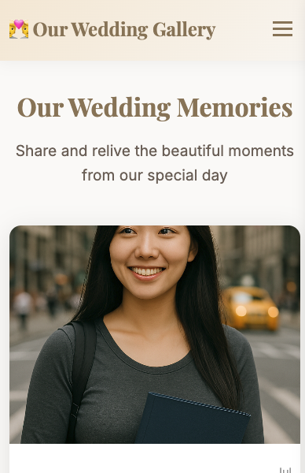
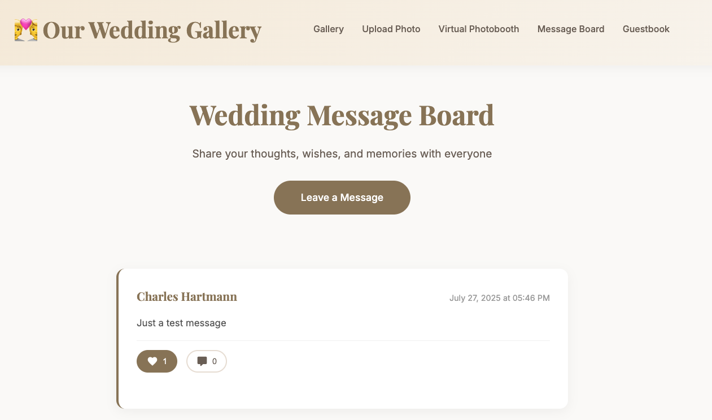

# VowVault - Wedding Photo Gallery

A beautiful, modern wedding photo gallery with advanced features including SSO authentication, PWA support, and comprehensive admin tools.

## ✨ Features

### 📸 Photo Management
- **Drag & Drop Upload**: Easy photo and video uploads
- **Auto-Organization**: Automatic sorting by upload date
- **Like & Comment System**: Interactive engagement features

- **Virtual Photobooth**: Custom wedding-themed photo capture
- **Video Support**: Full video upload and playback support

### 🔐 Security & Authentication
- **SSO Integration**: Secure Single Sign-On with multiple providers
  - Google OAuth 2.0
  - Microsoft Azure AD
  - Okta
  - Custom OAuth providers
- **Enhanced Security**: CSRF protection, timeout handling, secure sessions
- **Access Control**: Email and domain-based authorization
- **Admin Key Fallback**: Backup authentication method
- **Disabled by Default**: SSO is disabled by default for security

### 📱 Progressive Web App
- **Installable**: Add to home screen on mobile devices
- **Offline Support**: Works without internet connection
- **Push Notifications**: Real-time updates and alerts
- **Responsive Design**: Optimized for all screen sizes

### 🎨 Interactive Features
- **Message Board**: Share thoughts and memories with photos
- **Digital Guestbook**: Digital signatures with photo attachments
- **QR Code Generation**: Easy sharing and access
- **Slideshow Mode**: Automatic photo presentation
- **Email Integration**: Photo uploads via email

### ⚙️ Admin Dashboard
- **Comprehensive Statistics**: Upload counts, engagement metrics
- **Content Moderation**: Hide/show messages and comments
- **Batch Operations**: Bulk download and management
- **System Monitoring**: Performance and security logs
- **SSO Management**: Complete SSO configuration interface
- **Timezone Support**: View all dates/times in your local timezone
- **Timezone Settings**: Configure admin timezone preferences

## 🖼️ Screenshots

### Gallery Interface

*Beautiful photo gallery with modern design*

### Upload Interface

*Drag-and-drop photo upload with progress tracking*

### Mobile Experience

*Responsive design optimized for mobile devices*


*Progressive Web App installation prompt on mobile*

### Admin Dashboard

*Comprehensive admin panel with statistics and management tools*


*PWA debugging and troubleshooting tools*

### Interactive Features

*Virtual photobooth with custom wedding borders*


*Interactive message board with photo sharing*


*Digital guestbook with photo attachments*


## 🚀 Quick Start

### Using Docker (Recommended)
```bash
git clone https://github.com/chartmann1590/VowVault.git
cd VowVault
docker-compose up -d
```

### Manual Installation
```bash
git clone https://github.com/chartmann1590/VowVault.git
cd VowVault
python -m venv venv
source venv/bin/activate  # On Windows: venv\Scripts\activate
pip install -r requirements.txt
python migration.py
python run.py
```

**Access:** 
- Gallery: http://localhost
- Admin: http://localhost/admin?key=wedding2024
- SSO Login: http://localhost/sso/login (when SSO is enabled)

## 📚 Documentation

For detailed information, see our comprehensive documentation:

- **[Features](docs/features.md)** - Complete feature breakdown and capabilities
- **[Installation Guide](docs/installation.md)** - Setup instructions and troubleshooting
- **[SSO Setup](docs/sso_setup.md)** - Configure secure admin authentication with enhanced security
- **[Usage Guide](docs/usage.md)** - Step-by-step user instructions
- **[PWA Guide](docs/pwa.md)** - Progressive Web App setup and troubleshooting


## 🔧 Configuration

### Security
- Change the default admin key in `app.py`
- Enable SSO authentication for enhanced security (disabled by default)
- Set up HTTPS/SSL for production
- Configure proper backup strategy
- Review security best practices in SSO documentation

### Environment Variables
Copy `env.example` to `.env` and configure:
- Email settings for photo uploads
- Immich server sync settings
- Database configuration

## 🤝 Contributing

1. Fork the repository
2. Create a feature branch
3. Make your changes
4. Submit a pull request

## 📄 License

This project is licensed under the MIT License - see the [LICENSE](LICENSE) file for details.

The MIT License is a permissive license that allows for:
- Commercial use
- Modification
- Distribution
- Private use

While providing liability protection for the authors. See the full license text for complete terms.

## 🙏 Acknowledgments

- Built with [Flask](https://flask.palletsprojects.com/)
- Icons by [Feather Icons](https://feathericons.com/)
- PWA implementation with modern web standards
- Beautiful design inspired by wedding aesthetics

---

**Made with ❤️ for your special day**

*Created by [Charles Hartmann](https://github.com/chartmann1590)*